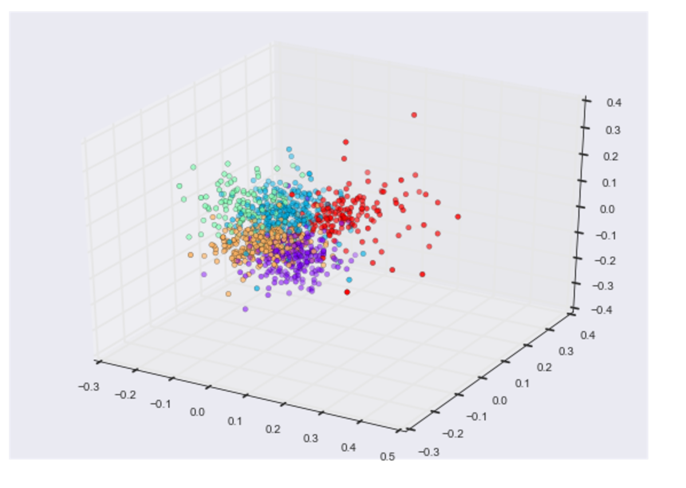

# TED-Talks-Topic-modeling-and-classification

# REPORT:

Problem formulation :

1- Understanding the topics and words that describe the broad categories of TED talks.

2- classifying the talks based on the content of the talk.

3- Being able to retrieve a relevant TED talk using a sentence or a keyword

## Goal:

#### Topic Modeling 

#### Classify documents into their categories

#### Information retrieval using DOC2VEC

## Data Descreption:

Web scraped TED talk transcripts Category wise  -- I included my code for the scraper too.

835 TED talks 

5 Categories: 

business = 123 |
entertainment = 152 |
global issues = 245 |
science = 209 |
technology = 249

## Pre-process:

#### encoding

#### Stop words removal and punctuations

#### Lemmatization

#### POS tagging and retaining “NN” and “NNP” -  helps Topic Modeling

## EDA

## Topic Modeling:
TFIDF/count vectorize 

LDA:

nmf:

NMF better than LDA

pyLDAvis

Around 45% accuracy after manually labelling the topics and assigning the document to the topic with maximum weight 

## Doc2Vec:

Visualization using Manifold's MDS(Multi-Dimensional Scaling) function - Plots similarity between document vectors.

5 colors represent 5 categories :

# BEST MODEL - SVM - 78% accuracy : 
### parameters : [SVC(C=1, cache_size=200, class_weight=None, coef0=0.0,
### decision_function_shape=None, degree=3, gamma=1, kernel='sigmoid',
### max_iter=-1, probability=False, random_state=None, shrinking=True,
###  tol=0.001, verbose=False)]

# Base line accuracy : 30%

# Accuracy and AUC on TFIDF :

### SVM = ACCURACY: 78% | AUC: 0.88

### Random forest = ACCURACY: 63% | AUC: 0.85

### knn = ACCURACY: 65% | AUC: 0.85

### gradient boosting = ACCURACY: 54% | AUC: 0.74

### LDA = ACCURACY: 49 % | AUC: 0.7 

# Accuracy on Doc2Vec document vectors (Just to see how they perform):

### Random Forest =  ACCURACY: 57%

### Knn = ACCURACY: 56.6%

## Future plans:

LDA2vec

###references: 

Sklearn  - Roc curve code

